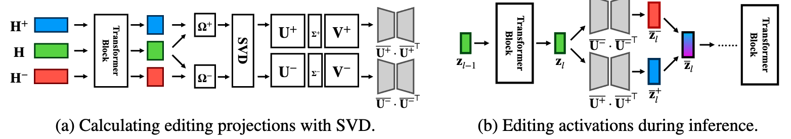

<div align="center">

<h1 style="text-align: center;">🌊 SEA: Spectral Editing of Activations for Large Language Model Alignment</h1>

<div>
  <sup>1</sup><a href='https://yfqiu.netlify.app/' target='_blank'><b>Yifu Qiu</b></a>&emsp;
  <sup>1</sup><a href='https://scholar.google.com/citations?user=UO0MJeQAAAAJ&hl=en' target='_blank'>Zheng Zhao</b></a>&emsp;
  <sup>1</sup><a href='https://scholar.google.co.il/citations?user=37SMCrsAAAAJ&hl=iw' target='_blank'>Yftah Ziser</b></a>&emsp;
  
  <sup>2</sup><a href='https://scholar.google.co.uk/citations?user=SCoVoOYAAAAJ&hl=en' target='_blank'>Anna Korhonen</b></a>&emsp;
  <sup>1</sup><a href='https://ducdauge.github.io/' target='_blank'>Edoardo M. Ponti</b></a>&emsp;
  <sup>1</sup><a href='https://scholar.google.com/citations?user=Q4oVM7IAAAAJ&hl=en' target='_blank'>Shay B. Cohen</b></a>&emsp;

</div>
<div><sup>1</sup>ILCC, University of Edinburgh</div>
<div><sup>2</sup>Language Technology Lab, University of Cambridge</div>

<div>
<h4>

 

[](https://github.com/yfqiu-nlp/sea-llm/stars)
[](https://github.com/yfqiu-nlp/sea-llm/issues)

</h4>
</div>

\

<div align="left">

## Abstract
Large language models (LLMs) often exhibit undesirable behaviours, e.g., generating untruthful or biased content. Editing their internal representations has been shown to be effective in mitigating such behaviours. We propose a novel _inference-only_ editing method, namely spectral editing of activations (SEA), to project the input representations into directions with _maximal_ covariance with the positive demonstrations (e.g., truthful) while _minimising_ covariance with the negative demonstrations (e.g., hallucinated). We also extend our method to non-linear editing using feature functions. Extensive experiments on benchmarks concerning truthfulness and bias with six popular open-sourced LLMs of different sizes and model families demonstrate the superiority in inference efficiency and effectiveness of our method compared to several strong baselines.


## Cite Our Work

```bib
@misc{qiu2024spectral,
      title={Spectral Editing of Activations for Large Language Model Alignment}, 
      author={Yifu Qiu and Zheng Zhao and Yftah Ziser and Anna Korhonen and Edoardo M. Ponti and Shay B. Cohen},
      year={2024},
      eprint={2405.09719},
      archivePrefix={arXiv},
      primaryClass={cs.CL}
}
```

## Setup Environment

You can find all required packages and their versions in `sea.yml` file. Remember to check and change the prefix `/PATH-TO-CONDA/` to your conda path. And you can setup the environment by,

```
conda env create --name sea --file=sea.yml
```

Please also put your own huggingface token into `src/models/huggingface.py` for accessing required models such as LLaMA-2-Chat-7B.

## How to Run
### Method 1: Run SEA from the Scratch

There are three steps to run SEA,

1. Firstly, we need to trace the activations for positive/negative/base demonstrations. Once these activations are computed and saved, we do not need to run this phase again,

```
sh prepare-activations.sh
```

2. Once we have all activations, we use spectral decomposition to compute positive and negative editing projections, $\overline{\mathbf{U}^+} \cdot {\overline{\mathbf{U}^+}^{\top}}$ and $\overline{\mathbf{U}^-} \cdot {\overline{\mathbf{U}^-}^{\top}}$.

3. In inference time, we simply apply this editing projections as an additional layer into forward computation when we evaluate LLMs on benchmarks. 

**To run 2nd and 3rd step, you can simply run the following scripts for TruthfulQA and BBQ.**

```
sh run-truthfulqa.sh
sh run-bbq.sh
```

### Method 2: Run SEA with Our Calculated Projections

Alternatively, you can download our calculated projections and bake it in to the LLM you are evaluating, which means you can skip the 2nd and 3rd steps in running SEA from scratch.

First, please donwload our calculated projections from [google clouds]() and place the corresponding projections into `./bias_projections` and `./truthful_projections`.

Then you can again run the following scripts for TruthfulQA and BBQ.

```
sh run-truthfulqa.sh
sh run-bbq.sh
```

###  Method 3: Quick Use of SEA w/ Huggingface Models

We provide a template for a quick run with SEA-edited LLaMA-2-Chat-7B model.

```python
from transformers import AutoModelForCausalLM, AutoTokenizer
from src.decoding_algorithm.inference import *

model_name = "meta-llama/Llama-2-7b-chat-hf"
model = AutoModelForCausalLM.from_pretrained(model_name, device_map="auto")
tokenizer = AutoTokenizer.from_pretrained(model_name)

positive_proj_path = "truthful_projections/llama-2-chat-7b-halueval-qa-2000-kRatio-P99.8-N99.8/uu_positive.pt"
negative_proj_path = "truthful_projections/llama-2-chat-7b-halueval-qa-2000-kRatio-P99.8-N99.8/uu_negative.pt"

model_wrapper = model_with_adapter(model)
model = model_wrapper.get_model((positive_proj_path, negative_proj_path), apply_sea_layers="last-L", L=21, combine_sea_embeddings="l2_norm", feature_function=None)


prompt = "Where were fortune cookies invented?"

model_inputs = tokenizer([prompt], return_tensors="pt").to("cuda")
model.to("cuda")

generated_ids = model.generate(**model_inputs, max_new_tokens=256, do_sample=True)
tokenizer.batch_decode(generated_ids)[0]
```

## Acknowledgment

Part of the code is developed from [Induce-then-Contrast Decoding](https://github.com/HillZhang1999/ICD/tree/main) and [In-context Vectors](https://github.com/shengliu66/ICV/tree/main) projects. Thanks for their great works!


